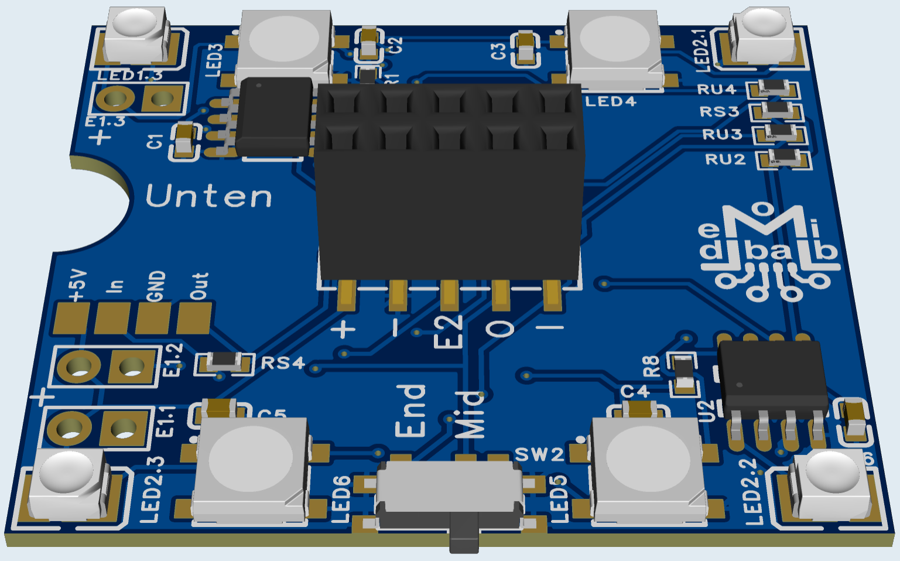
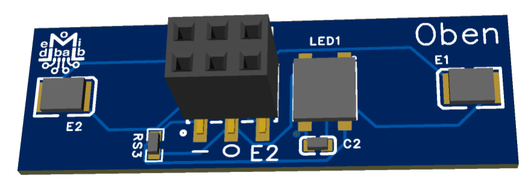

# Hausdeckenlicht (296-G)
Mit dieser kleinen Platine (35x40mm) kann man "jedes" Häuschen beleuchten ohne das man winzige LEDs anlöten und montieren muss:

Eine Platine ist für 4 Räume gedacht
4 RGB LEDs (TV, offener Kamin, farbiges Licht)
4 Warmweise LEDs
Zwei zusätzliche Ausgänge für Außenlichter oder Ähnliches

Siehe [Mobaledlib Forum](https://forum.mobaledlib.de/viewtopic.php?t=807).

# Dachlichtplatine (296-D)
Die EasyEDA Pro Dateien der Platine befinden sich in der Datei Hausdeckenlicht.eprj.
Dort findet man auch die zweite Paltine welche im Dach eines Hauses eingestetzt werden kann:

Sie ist nur mit einer RGB LED und zwei warm Weißen LEDs bestückt.
